# **塊魂**

動画リンク:https://www.youtube.com/watch?v=RzwWIAPEENg
<br>

# **目次**
- [**塊魂**](#塊魂)
- [**目次**](#目次)
- [**自己紹介**](#自己紹介)
- [**ゲーム概要**](#ゲーム概要)
- [**操作方法**](#操作方法)
- [**制作理由**](#制作理由)
- [**ゲームのこだわり**](#ゲームのこだわり)
  - [**1.タイトル画面**](#1タイトル画面)
  - [**2.ゲーム中カメラの動き**](#2ゲーム中カメラの動き)
  - [**3.ゲーム内の操作**](#3ゲーム内の操作)
  - [**4.巻き込めないオブジェクト**](#4巻き込めないオブジェクト)
- [**技術紹介**](#技術紹介)
  - [**1.巻き込み処理**](#1巻き込み処理)
    - [**作成動機**](#作成動機)
    - [**実装方法**](#実装方法)
    - [**a.オブジェクトと塊のワールド行列を求めて、塊のワールド行列の逆行列を求める**](#aオブジェクトと塊のワールド行列を求めて塊のワールド行列の逆行列を求める)
    - [**b.塊を基準としたオブジェクトのローカル座標を求める**](#b塊を基準としたオブジェクトのローカル座標を求める)
    - [**c.最終的なオブジェクトのワールド行列を求める**](#c最終的なオブジェクトのワールド行列を求める)
    - [**まとめ**](#まとめ)
  - [**2.オブジェトデータの管理とオブジェクトの生成**](#2オブジェトデータの管理とオブジェクトの生成)
    - [**作成動機**](#作成動機-1)
    - [**実装方法**](#実装方法-1)
    - [**a.エクセルの作成**](#aエクセルの作成)
    - [**b.レベルデータの作成**](#bレベルデータの作成)
    - [**c.モデルの検索**](#cモデルの検索)
    - [**d.モデルの移動**](#dモデルの移動)
    - [**まとめ**](#まとめ-1)
  - [**3.インスタンシング描画**](#3インスタンシング描画)
    - [**インスタンシング描画について**](#インスタンシング描画について)
    - [**作成動機**](#作成動機-2)
    - [**作成方法**](#作成方法)
    - [**a.インスタンシング番号の設定**](#aインスタンシング番号の設定)
    - [**b.描画用クラスの作成**](#b描画用クラスの作成)
    - [**ｃ.シェーダー側にデータを渡す**](#ｃシェーダー側にデータを渡す)
    - [**d.シェーダー側の処理**](#dシェーダー側の処理)
    - [**まとめ**](#まとめ-2)
  - [**4.UI用のモデルの描画**](#4ui用のモデルの描画)
    - [**作成動機**](#作成動機-3)
    - [**UI用のカメラを作成し、同じレンダーターゲットにする**](#ui用のカメラを作成し同じレンダーターゲットにする)
    - [**まとめ**](#まとめ-3)
  - [**5.輪郭線の描画**](#5輪郭線の描画)
    - [**作成動機**](#作成動機-4)
    - [**実装方法**](#実装方法-2)
    - [**a.モデルの深度値をテクスチャに書き込む**](#aモデルの深度値をテクスチャに書き込む)
    - [**b.深度テクスチャと近傍８テクセルの深度値を差を調べる**](#b深度テクスチャと近傍８テクセルの深度値を差を調べる)
    - [**まとめ**](#まとめ-4)
  - [**6.トゥーンシェーダー**](#6トゥーンシェーダー)
    - [**作成動機**](#作成動機-5)
    - [**実装方法**](#実装方法-3)
    - [**法線とライトの方向とで内積を計算するし、値が一定以下の時に最終的なカラーの色素を落とす**](#法線とライトの方向とで内積を計算するし値が一定以下の時に最終的なカラーの色素を落とす)
    - [**まとめ**](#まとめ-5)
  - [**7.カスケードシャドウ**](#7カスケードシャドウ)
    - [**カスケードシャドウについて**](#カスケードシャドウについて)
    - [**実装方法**](#実装方法-4)
    - [**a.分割エリアの定義**](#a分割エリアの定義)
    - [**b.分割エリアを描画するためにライトビュープロジェクション行列を求める**](#b分割エリアを描画するためにライトビュープロジェクション行列を求める)
    - [**c.3枚のシャドウマップを生成して影を落とす**](#c3枚のシャドウマップを生成して影を落とす)
    - [**まとめ**](#まとめ-6)
  - [**8.ディファードレンダリング**](#8ディファードレンダリング)
    - [**ディファードレンダリングについて**](#ディファードレンダリングについて)
    - [**作成動機**](#作成動機-6)
    - [**a.G-Bufferを作成する**](#ag-bufferを作成する)
    - [**b.ライティングの計算を行う**](#bライティングの計算を行う)
    - [**まとめ**](#まとめ-7)
    - [**9.フォワード、ディファードレンダリングの併用**](#9フォワードディファードレンダリングの併用)
    - [**併用理由**](#併用理由)
    - [**まとめ**](#まとめ-8)
- [**参考資料**](#参考資料)
    - [**参考書**](#参考書)


# **自己紹介**
**所属：河原電子ビジネス専門学校ゲームクリエイター科**
<br>

**名前：伊藤　大起**
<br>

**趣味：弓道(3年)、料理**
<br>

# **ゲーム概要**
**1.制作期間**
<br>
&emsp;**2023年10月～**
<br>

**2.制作人数**
<br>
&emsp;**1人**
<br>

**3.ジャンル**
<br>
&emsp;**アクション**
<br>

**4.プレイ人数**
<br>
&emsp;**1人**
<br>

**5.対応ハード**
<cr>
&emsp;**windows11**
<br>

**6.制作環境**
<br>
&emsp;**a.エンジン**
<br>
&emsp;&emsp;**学校内製エンジン(DX12)**
<br>

&emsp;**b.使用ツール**
<br>
&emsp;&emsp;**Visual Studio 2022**
<br>
&emsp;&emsp;**Visual Studio Code**
<br>
&emsp;&emsp;**3ds Max 2023**
<br>
&emsp;&emsp;**Adobe Photoshop 2022**
<br>
&emsp;&emsp;**Excel**
<br>
&emsp;&emsp;**RenderDoc**
<br>
&emsp;&emsp;**fork**
<br>
&emsp;&emsp;**Github**
<br>
&emsp;&emsp;**Notion**
<br>

&emsp;**c.使用言語**
<br>
&emsp;&emsp;**C++**
<br>
&emsp;&emsp;**HLSL**
<br>

# **操作方法**

<br>

# **制作理由**
&emsp;**自分がこのゲームを作ろうと思ったのがきっかけとして、今まで自分がプレイしてきたゲームは敵を武器を使って倒すというゲームが多く、物を巻き込み塊を大きくしていくという、独自の世界観にひかれていきました。**
<br>

&emsp;**最初のうちは巻き込まないものがあり、それにはじき返されたり、追いかけまわされるなど最初のうちは爽快感はありませんでしたが、物を巻き込み塊が大きくなり今まで追いかけられていた物を巻き込めるようになると、敵を武器を使って倒した時のような爽快感があり、その爽快感が後半は何度も押し寄せるので自分はこのゲームにとても関心を持ちました。**
<br>

&emsp;**ゲーム制作の勉強をしていく内にこのゲームは様々な技術をしようしていることを知り、このゲームを再現することで、今まで挑戦してこなかった技術に触れあうことが可能なので、自身のスキルアップにつながると思いこのゲームを製作しようと思いました。**
<br>

# **ゲームのこだわり**
## **1.タイトル画面**
**・AボタンでスタートではなくSTARTを巻き込むことで始めることが出来る。**
<br>
**・ゲームの始まりを意識しやすくするため。**
<br>

<br>

## **2.ゲーム中カメラの動き**
**・塊が大きくなるにつれて画面に入らなくなるので、一定の大きさの時に後退している**
<br>

<br>
**・カメラを後退させるときに滑らかに動かすことで、違和感が無い様にしている**
<br>
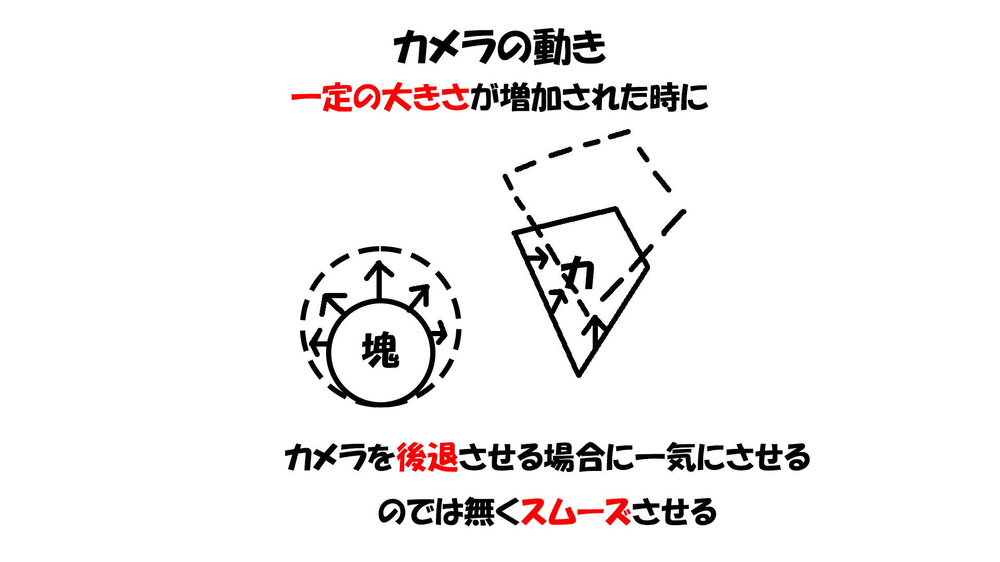

## **3.ゲーム内の操作**

<br>
**・操作性をよくするため急周りの際に、速度がある場合、カメラの動きに合わせた動きしている。**
<br>


## **4.巻き込めないオブジェクト**

<br>
**・巻き込めないオブジェクトにぶつかった時に反射している**
<br>
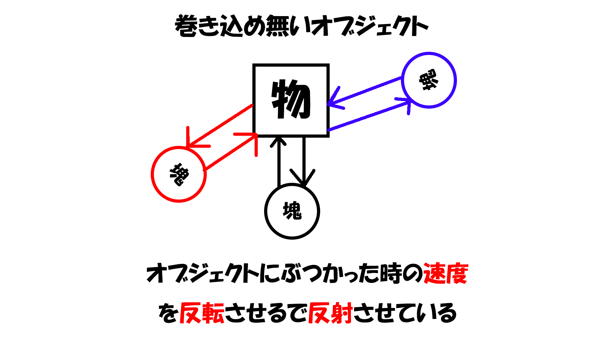

# **技術紹介**

## **1.巻き込み処理**

### **作成動機**
**・塊魂を再現する際に最も興味を持った処理だから。**
<br>
**・行列に対する勉強の良い機会だと思った。**

### **実装方法**
### **a.オブジェクトと塊のワールド行列を求めて、塊のワールド行列の逆行列を求める**

**・ワールド行列を求める方法**
<br>

### **b.塊を基準としたオブジェクトのローカル座標を求める**
**・逆行列を乗算することでワールド行列からローカル行列への変換を行える**
<br>
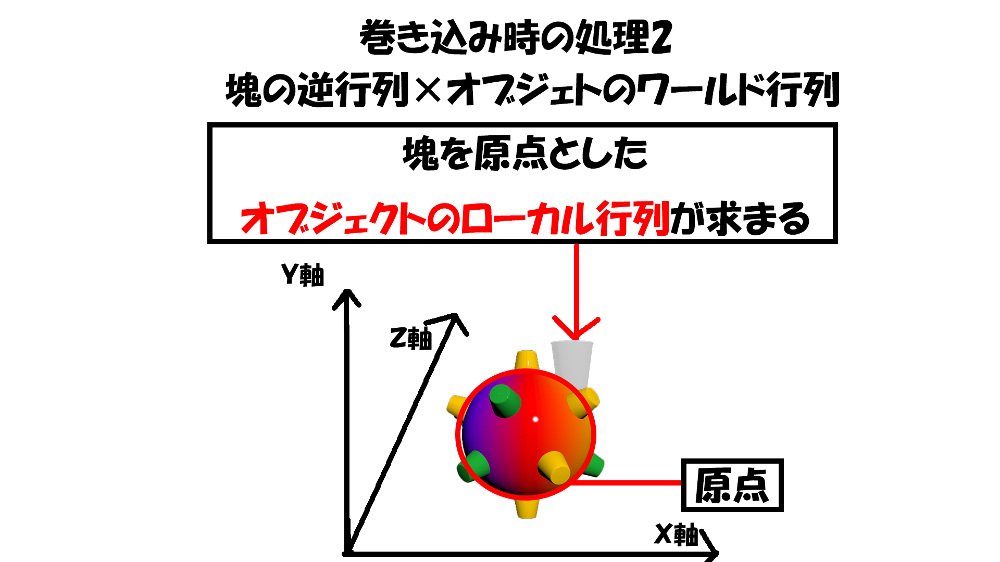
### **c.最終的なオブジェクトのワールド行列を求める**

### **まとめ**
**・逆行列やローカル行列の勉強になった。**
<br>
**・今後のゲーム制作を行う際に行列を生かした難しい処理を実装していきたい。**
<br>

## **2.オブジェトデータの管理とオブジェクトの生成**
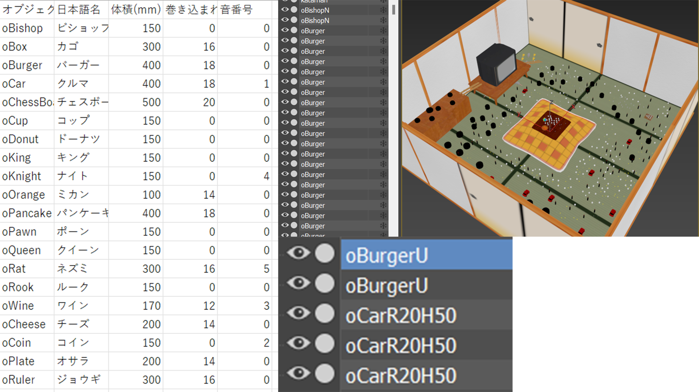
### **作成動機**
**・エクセルを使用したデータ管理に挑戦するため。**
<br>
**・今まで大量のオブジェクトを生成する機会がなく、データ管理をする機会がありませんでしたが、今回はエクセルとかで管理しないと大変なため**
<br>
**・文字列を使用してモデルの動きや速度を決めるため。**

### **実装方法**
### **a.エクセルの作成**

<br>
**・保存形式を気を付ける必要がある**
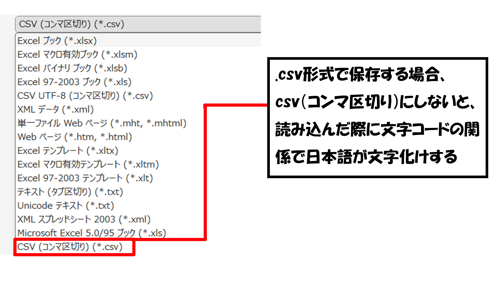
<br>
**・モデルデータの構造体に渡す**
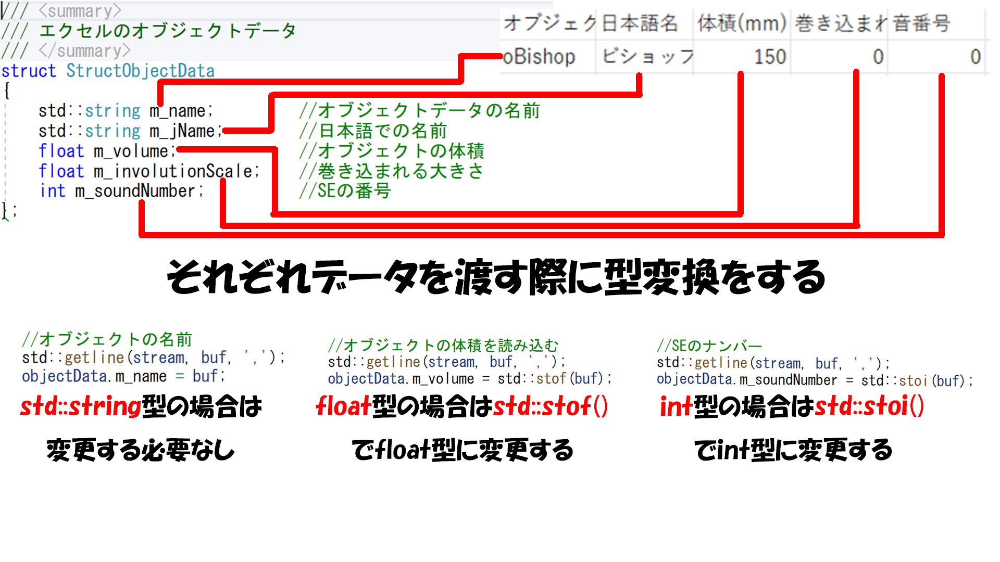
<br>
### **b.レベルデータの作成**

<br>
**・レベルデータの名前で移動速度と移動方法を決めている。**
<br>
**・これにより細かい数値を決めやすくなる。**
### **c.モデルの検索**

<br>
### **d.モデルの移動**
**・モデルの移動はレベルデータを元に生成する**
<br>

<br>
**・モデルの生成はインスタンシング描画にも関係している**
### **まとめ**
**・エクセルデータを保存した時に日本語が文字化けするなど問題が発生していた。**
<br>
**・文字コードを勉強する過程で、変数変換の勉強になった。**
<br>
**・今後もエクセルなどを使用したデータ管理を有効活用して行きたい。**
<br>

## **3.インスタンシング描画**

### **インスタンシング描画について**
**・通常のドローコールと違い一つ一つモデルを描画するのではなく、「同じモデルを大量に描画する際のドローコールを一度だけにできる」というテクニック**
### **作成動機**
**・通常のドローコールではfpsが10以下しか出なかったので、その問題を解決するため。**
### **作成方法**
### **a.インスタンシング番号の設定**

<br>
**・mapを使用した種類ごとの管理プログラム**
```h
// インスタンスの番号を付ける
object->SetInstanceNo(instanceCount[objectData.m_name]);
instanceCount[objectData.m_name]++; // インスタンス番号を更新
m_objctList.emplace_back(object);
```
### **b.描画用クラスの作成**
**・通常描画との違い**
<br>

<br>
**・レンダークラスの作成プログラム**
```H
//オブジェトデータのリストを持ってくる
for (auto objectData : ObjectData::GetInstance()->GetObjectData()) {
	int numObject = 0;
	//オブジェトの数だけ回す
	for (int i = 0; i < m_objctList.size(); i++) {
		//データとオブジェクトリストの名前が一緒なら
		if (m_objctList[i]->GetObjectName() == objectData.m_name) {
			//インスタスの最大数を上げる
			numObject++;
		}
	}
//インスタンシング描画用のレンダーを作成する
ObjectRender* objectRender = NewGO<ObjectRender>(0, objectData.m_name.c_str());
objectRender->SetObjectData(objectData);
//インスタスの最大数を渡す
objectRender->SetMaxObject(numObject);
}
```
### **ｃ.シェーダー側にデータを渡す**
**・シェーダー側に渡すためにバッファを確保する**
<br>

<br>
```H
//インスタンシング描画を行う場合は、拡張SRVにインスタンシング描画用のデータを設定する。
			shadowModelInitData.m_expandShaderResoruceView[0] = &m_worldMatrixArraySB;
			shadowModelInitData.m_vsEntryPointFunc = "VSMainInstancing";
```
### **d.シェーダー側の処理**
**・現在処理しているインスタンスの番号を持ってこれるようにしている**
<br>
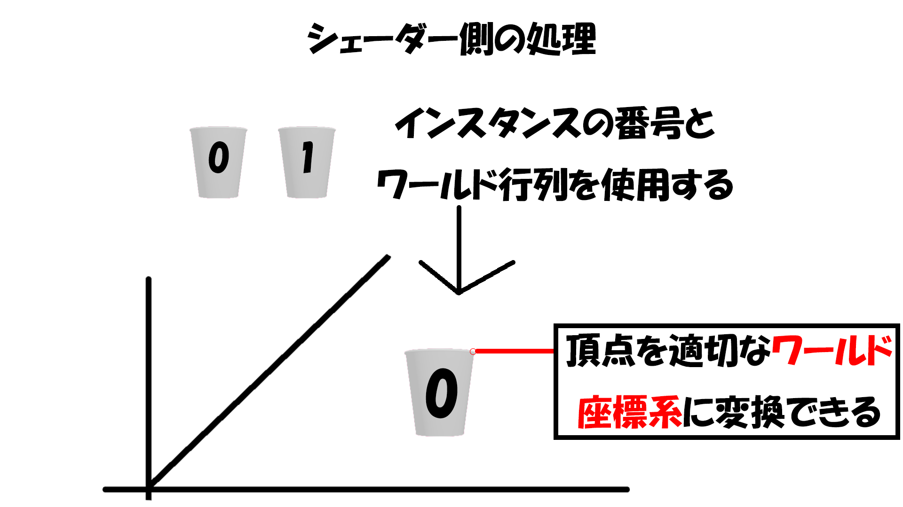
<br>
```H
/// <summary>
/// スキンなしメッシュ用の頂点シェーダーのエントリー関数(インスタンシング描画用)。
/// </summary>
SPSIn VSMainInstancing(SVSIn vsIn,uint instanceID : SV_InstanceID)
{
	return VSMainCore(vsIn,g_worldMatrixArray[instanceID]);
}
```
**・これによりモデルを出力することでインスタンシング描画の完成**
<br>

### **まとめ**
**・ゲームをプレイする際に問題ない速度で動くようになった**
<br>
**・今後同じのモデルを複数生成する際にfpsが落ちないように実装していきたい。**

## **4.UI用のモデルの描画**
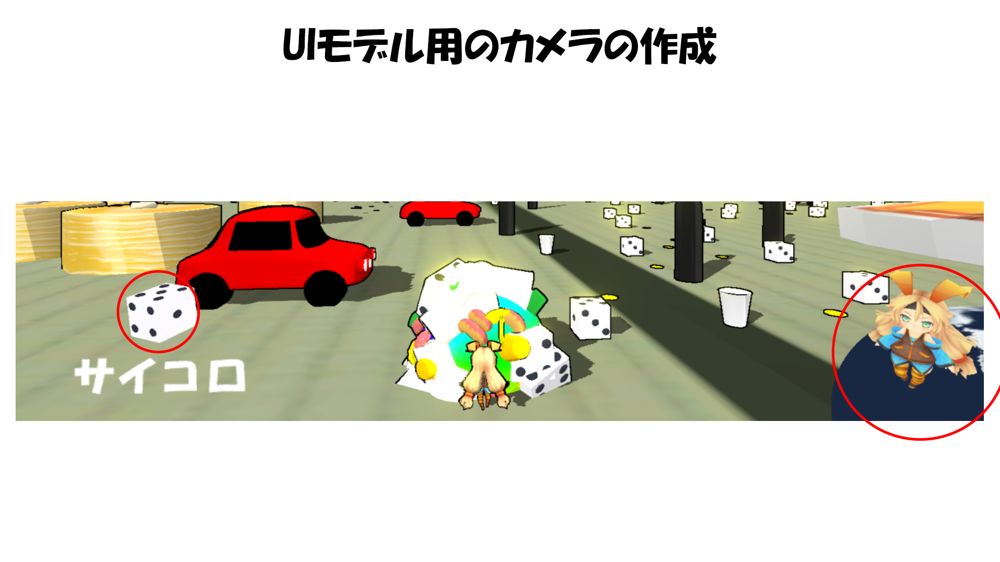
### **作成動機**
**・UIを作成する際にメインカメラ影響を受けないようにするため**
### **UI用のカメラを作成し、同じレンダーターゲットにする**

### **まとめ**
**・ゲーム内に影響されないので違和感のないUI用のモデルが描画出来た。**


## **5.輪郭線の描画**
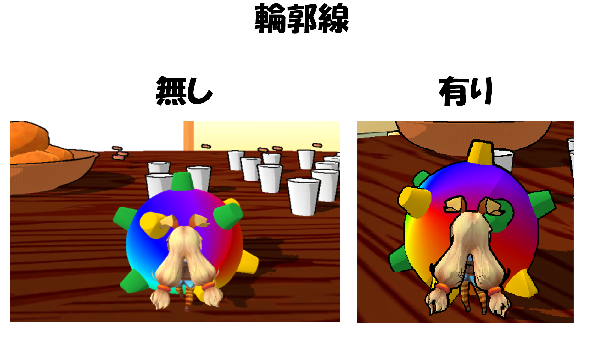
### **作成動機**
**・プレイヤーやオブジェクトの位置関係を分かりやすくするため**
### **実装方法**
### **a.モデルの深度値をテクスチャに書き込む**

### **b.深度テクスチャと近傍８テクセルの深度値を差を調べる**

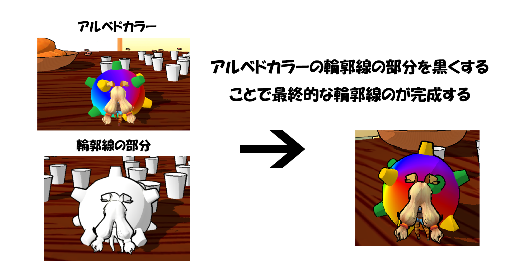
### **まとめ**
**・プレイヤーがわかりやすくなりプレイに支障が出にくくなった**

## **6.トゥーンシェーダー**

### **作成動機**
**・塊魂のような世界観を再現したかったので、なだらかな陰影をするのではなく、アニメ調の陰影を表示するため**
### **実装方法**
### **法線とライトの方向とで内積を計算するし、値が一定以下の時に最終的なカラーの色素を落とす**

### **まとめ**
**・今回はよくあるテクスチャを使用した実装ではなく、直接色素を落とすことで実装しました**
**・今度ゲーム制作を行う際はテクスチャを使用したトゥーンシェーダー実装したい**

<br>

## **7.カスケードシャドウ**
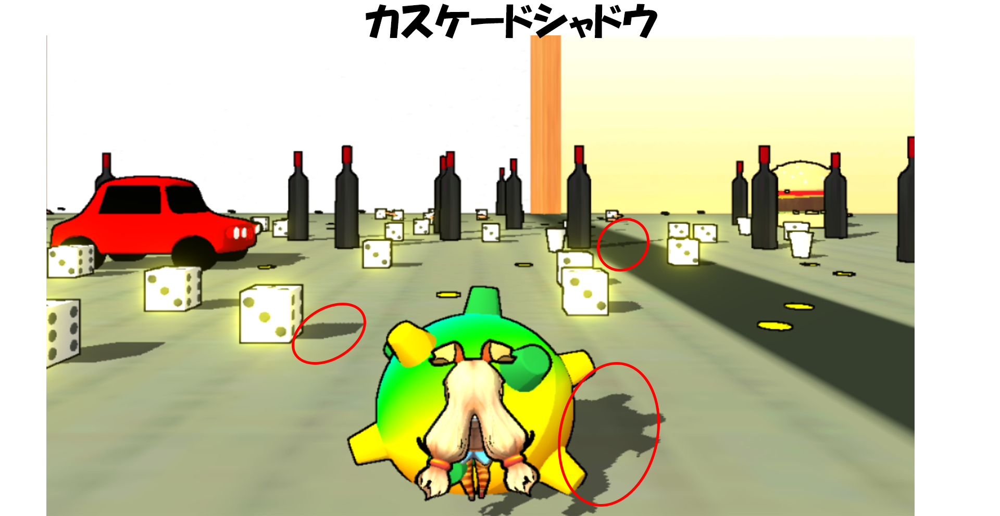
### **カスケードシャドウについて**
**・複数枚のシャドウマップを利用することで影の品質を向上さる処理**
### **実装方法**
### **a.分割エリアの定義**
**・カメラから見て近、中、遠距離にエリアを分割する**
<br>

<br>
```h
// 8頂点を求める
Vector3 vertex[8];
// 近平面の右上の頂点
vertex[0] += nearPos + cameraUp * nearY + cameraRight * nearX;
// 近平面の左上の頂点
vertex[1] += nearPos + cameraUp * nearY + cameraRight * -nearX;
// 近平面の右下の頂点
vertex[2] += nearPos + cameraUp * -nearY + cameraRight * nearX;
// 近平面の左下の頂点
vertex[3] += nearPos + cameraUp * -nearY + cameraRight * -nearX;
// 遠平面の右上の頂点
vertex[4] += farPos + cameraUp * farY + cameraRight * farX;
// 遠平面の左上の頂点
vertex[5] += farPos + cameraUp * farY + cameraRight * -farX;
// 遠平面の右下の頂点
vertex[6] += farPos + cameraUp * -farY + cameraRight * farX;
// 遠平面の左下の頂点
vertex[7] += farPos + cameraUp * -farY + cameraRight * -farX;
// 8頂点をライトビュープロジェクション空間に変換して、8頂点の最大値、最小値を求める
Vector3 vMax, vMin;
vMax = { -FLT_MAX, -FLT_MAX, -FLT_MAX };
vMin = { FLT_MAX,  FLT_MAX,  FLT_MAX };
for (auto& v : vertex){
    lvpcMatrix.Apply(v);
    vMax.Max(v);
    vMin.Min(v);
  }
```
### **b.分割エリアを描画するためにライトビュープロジェクション行列を求める**
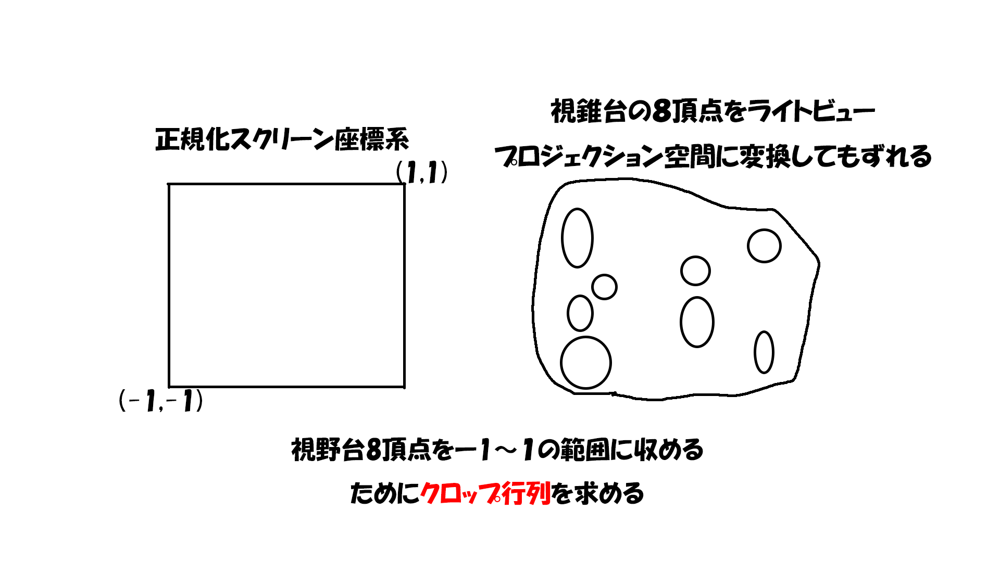
**・クロップ行列を求める**<br>

```h
float xScale = 2.0f / (vMax.x - vMin.x);
float yScale = 2.0f / (vMax.y - vMin.y);
float xOffset = (vMax.x + vMin.x) * -0.5f * xScale;
float yOffset = (vMax.y + vMin.y) * -0.5f * yScale;
Matrix clopMatrix;
clopMatrix.m[0][0] = xScale;
clopMatrix.m[1][1] = yScale;
clopMatrix.m[3][0] = xOffset;
clopMatrix.m[3][1] = yOffset;
```

<br>

### **c.3枚のシャドウマップを生成して影を落とす**
**・エリアごとにシャドウマップを生成する**
<br>

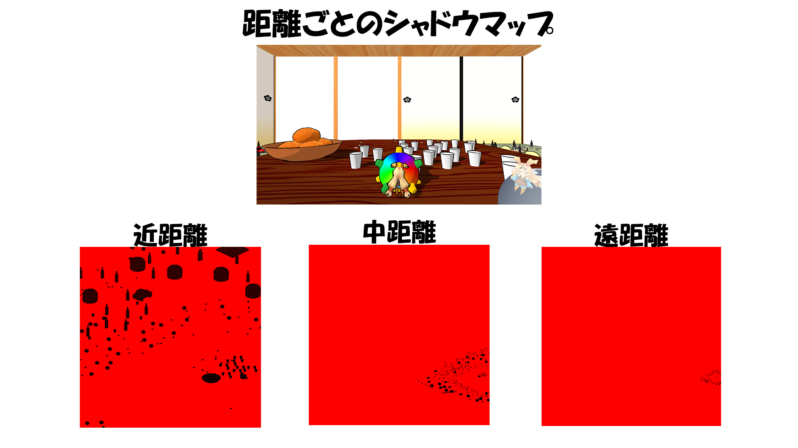
<br>
**・これにより影を落とすことが出来る**

### **まとめ**
**・ゲームの都合上遠くまで落とす必要がありジャギーが発生したのでそれを解決することが出来た。**

## **8.ディファードレンダリング**
### **ディファードレンダリングについて**
**・ポリゴンをレンダリングをするときはライティングの計算を行わずに、そのあとに行うという処理**
### **作成動機**
**・PBRとセルシェーダーを行う関係上フォワードレンダリングだけでは計算量が多くなってしまう**<br>
**・ディファードレンダリングを作成することでフォワードレンダリングでの計算量を減らすのが目的**
### **a.G-Bufferを作成する**
**・4つのテクスチャを作成する**

### **b.ライティングの計算を行う**
**・G-Bufferの情報を渡す**<br>
**・背景をディファードレンダリングをしている**<br>

### **まとめ**
**・大量のオブジェクトを作成するので重くなってしまう関係上、それを少しでも緩和することが出来て良かった**

<br>

### **9.フォワード、ディファードレンダリングの併用**
### **併用理由**
**・プレイヤーはアニメ調に床や壁はPBRと使い分けをしたかったため**<br>
**・プレイヤーはアニメ調に（フォワードレンダリング）**<br>
<br>
**・床と壁はPBRでリアリティに（ディファードレンダリング）**<br>

### **まとめ**
**・併用することで世界観をきれいに見せることが出来た**


# **参考資料**
### **参考書**
**HLSLシェーダーの魔導書**